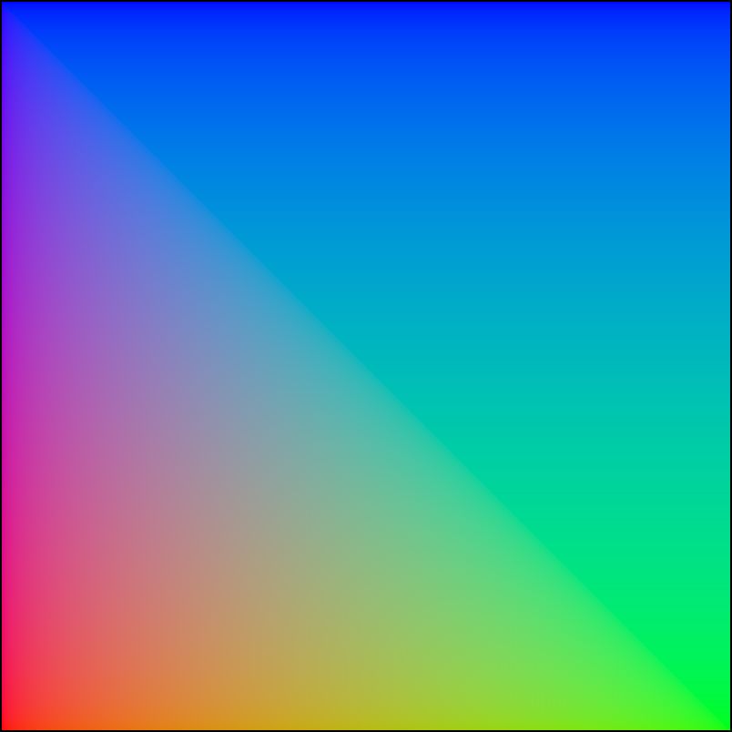
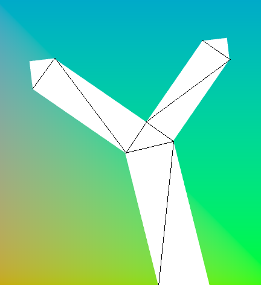
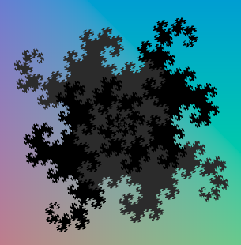

# Report for Assignment 1

20200245 박성지 Seongji Park

## Background

I made a background with color gradiant. I assigned colors for each corners of background.

- **blue** for **p1**(upper left) and **p2**(upper right)
- **red** for **p3**(lower left)
- **green** for **p4**(upper right)

Since the background is square, more than two triangles are needed. I decided to use two triangles.

- p1-p3-p4
- p1-p2-p4

## Fractal Tree

My fractal tree starts with one stem. Two stems are created from end of previous stem. Fractal tree is created with two initial points `this.point1` and `this.point2`.

One stem is consist of an rectangle and a right triangle. For a rectangle, length is 3 times longer than thickness. New stems are grown from other two sides of a triangle. The side of a triangle attached to a rectangle is a hypotenuse.

The angle of the triangle changes over time like sin function, and makes the tree's movement interesting. It seems that the stems are growing and shrinking repeatedly.

## Fractal Snowflakes (Dragon flake)

I used **dragon curve** for create snowflakes. (Because dragon curve is more visually fun than Koch curve... I think.) One dragon flake is consist of four dragon curves.

Since dragon curve is originally **curves**, so it must be converted into **mesh**. I grouped every two line segments, and created a square from that two line segments.

I assigned different colors for each dragon curves in dragon flake, so the shape of dragon curve can be noticed.

I created five dragon flakes and made them fall. Dragon flakes are falling, rotating and swaying.

To retain size regardless of the level, the length of line segment must be changed based on level. When the level increases by 1, length of line segment is multiplied by 0.67.

## User Input

I made 3 user inputs.

- **Tree level**: the level of fractal tree. It can have integer values between 1 and 15.
- **Dragon flake levl**: the level of dragon flake. It can have integer values between 1 and 18.
- **Dragon flake size**: the size of dragon flake. It can have real number values between 0.1 and 1.

Tree level and Dragon flake level have limit value, because more level requires more computations, and even cause stack overflow.
