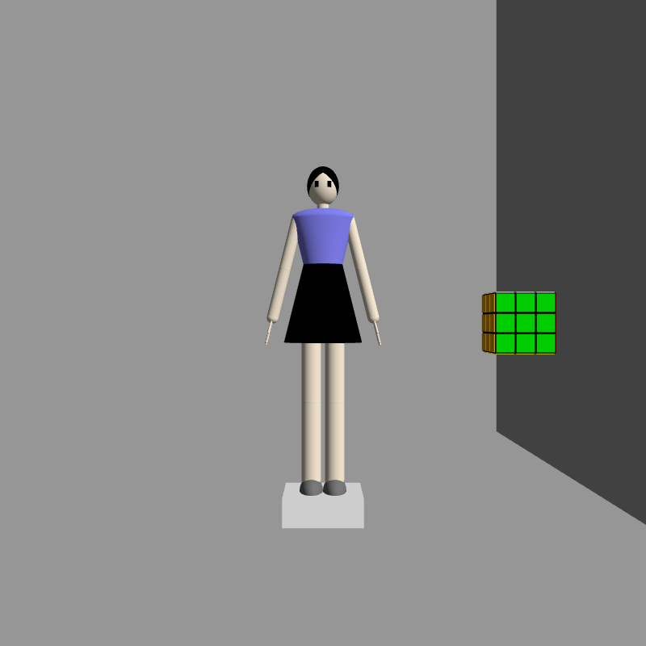
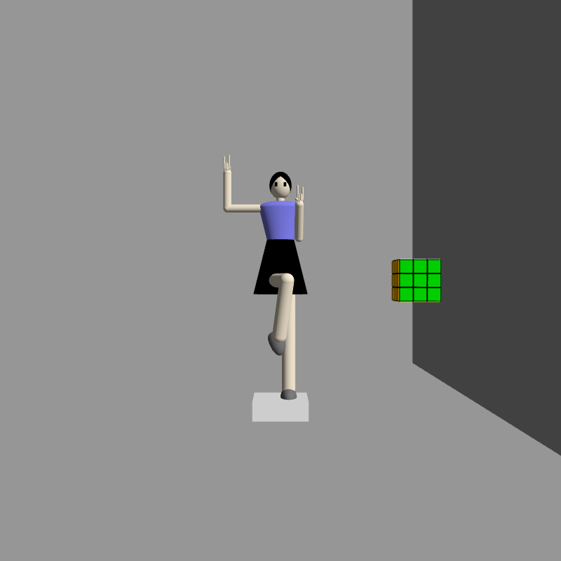
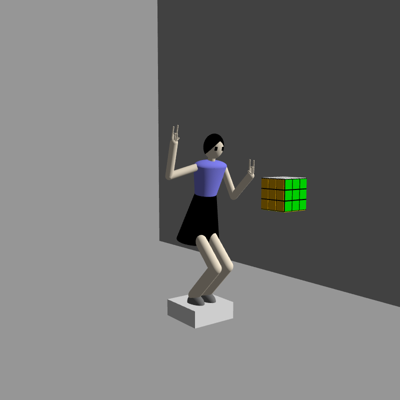
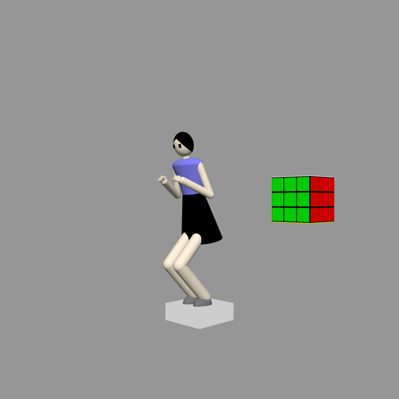
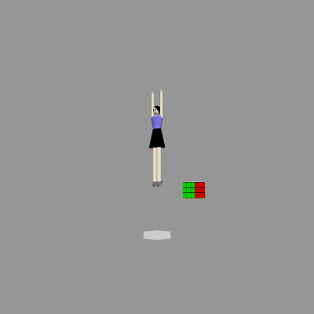
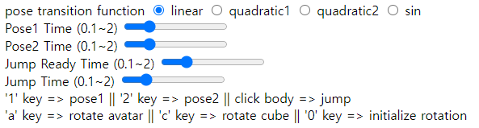
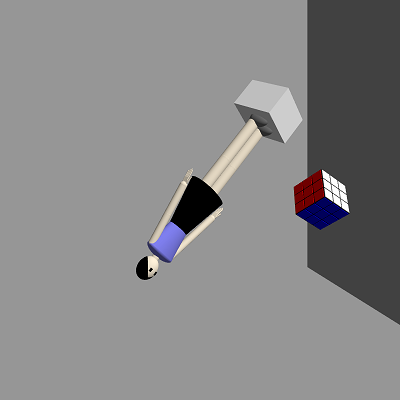
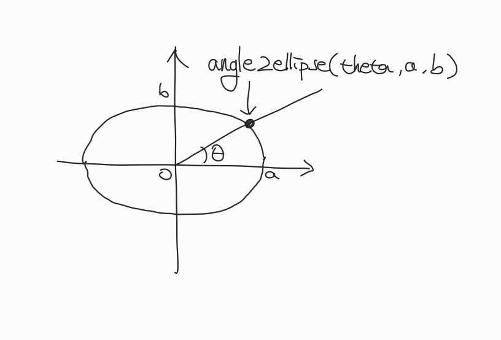
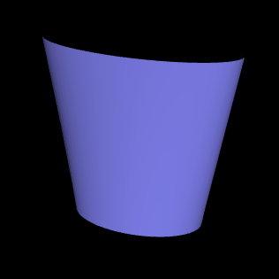

# Assignment 2: An Avatar of Lost Arcball

20200245 Seongji Park

## 3D Geometric Objects

First, I modified `generateSphere` function so that it can get radius as parameter.

### `generateCone(radius, height, sides)` function

- `radius`: Radius of circle.
- `height`: Height of cone.
- `sides`: Number of sides to generate circle. It has default value of 64.

A cone has two parts, bottom and side.

- bottom:
  Shape of bottom is circle, and a circle is places on xz-plane. Since I had to generate circle from polygons, I generated many polygons. The number of polygons to generate circle is `sides`. The normal vector of circle is `-y` direction.

- side:
  Side is set of lines connecting top point and a point on the bottom circle. Generating side is similar to generating bottom, except calculating normal vector. I assigned normal vector for each point in polygon. Assume each polygon has three points: `p0`(top point), `p1, p2`(on circumference). Let `p12` be the center of arc connecting `p1` and `p2`.

  - normal vector of `p0`: perpendicular to the line `p0-p12`
  - normal vector of `p1`: perpendicular to the line `p0-p1`
  - normal vector of `p2`: perpendicular to the line `p0-p2`

  Additionally, for every `p0`, `p1` and `p2`, the angle between normal vector and xz-plane is the angle between y-axis and line `p0-p1`(or line `p0-p2`).

  ```
  // pseudo code

  // bottom
  for (i = 0; i < sides; i++) {
    theta = i / sides * 2 * PI
    theta_ = (i + 1) / sides * 2 * PI
    _theta = (theta + theta_) / 2
    p0 = [0, 0, 0]
    p1 = [radius * cos(theta), 0, radius * sin(theta)]
    p2 = [radius * cos(theta_), 0, radius * sin(theta_)]
    n = [0, -1, 0]
    vertices.push(p0, p1, p2)
    normals.push(n, n, n)
  }

  // side
  for (i = 0; i < sides; i++) {
    theta = i / sides * 2 * PI
    theta_ = (i + 1) / sides * 2 * PI
    p0 = [0, height, 0]
    p1 = [radius * cos(theta), 0, radius * sin(theta)]
    p2 = [radius * cos(theta_), 0, radius * sin(theta_)]
    n0 = [height * cos(_theta), radius, height * sin(_theta)]
    n1 = [height * cos(theta), radius, height * sin(theta)]
    n2 = [height * cos(theta_), radius, height * sin(theta_)]
    vertices.push(p0, p2, p1)
    normals.push(n0, n2, n1)
  }
  ```

### `generateCylinder(radius, height, sides)` function

- `radius`: Radius of circle.
- `height`: Height of cylinder.
- `sides`: Number of sides to generate circle. It has default value of 64.

Cylinder is consist of bottom circle, top circle and side. The center of cylinder is `[0, 0, 0]`.

- bottom and top circles: Almost same with bottom of cone.
  - bottom circle: on `y=-height/2` plane. Normal vector is `-y` direction.
  - top circle: on `y=height/2` plane. Normal vector is `+y` direction.
- side: Side can be generated with thin rectangles. Assume each thin rectangle has four points: `p1, p2`(on bottom circle) and `p3, p4`(on top circle). Normal vector of all four points is parallel to xz-plane. Since polygon is triangle, I added `{p1, p4, p2}` and `{p1, p3, p4}` as polygon.

  - normal vector of `p1`, `p3`: direction from center of circle to `p1`, `p3` respectively
  - normal vector of `p2`, `p4`: direction from center of circle to `p2`, `p4` respectively

  ```
  // pseudo code

  // bottom and top circles: almost same with bottom of cone
  ...

  // side
  for (i = 0; i < sides; i++) {
    theta = i / sides * 2 * PI
    theta_ = (i + 1) / sides * 2 * PI
    p1 = [radius * cos(theta), -height/2, radius * sin(theta)]
    p2 = [radius * cos(theta_), -height/2, radius * sin(theta_)]
    p3 = [radius * cos(theta), height/2, radius * sin(theta)]
    p4 = [radius * cos(theta_), height/2, radius * sin(theta_)]
    n1 = [cos(theta), 0, sin(theta)]
    n2 = [cos(theta_), 0, sin(theta_)]
    vertices.push(p1, p4, p2)
    vertices.push(p1, p3, p4)
    normals.push(n1, n4, n2)
    normals.push(n1, n3, n4)
  }
  ```

### My own primitives: Capsule, Hemisphere, QuarterSphere

In order to generate avatar, I added more primitives.

- `generateCapsule(radius, height, sides)` function: Capsule is consist of one cylinder and two spheres.
- `generateHemisphere(radius)` function: Similar to `generateSphere`, but it only generates `y>0` part. It doesn't have bottom surface.
- `generateQuarterSphere(radius)` function: It only generates `y>0, z<0` part. It has bottom surface(on xz-plane).

Generating hemisphere and quarter sphere can be implemented easily with changing scope of `for` loop in `generateSphere`.

## Hierarchical Modeling of Avatar

My avatar has body, head, arms, hands, fingers, legs, and feet.

### Body Parts

My avatar has following parts.

- body (index 1) complex meshes
- head (index 2) combination of primitives
- armLU, armRU, armLD, armRD (index 3, 4, 5, 6) capsule
- footL, footR (index 7, 8) two quarter spheres
- legLU, legRU, legLD, legRD (index 9, 10, 11, 12) capsule
- handL, handR (index 13, 14) combination of primitives
- fingerLXY, fingerRXY: X has value of 1~5. if X is 1, then Y is 0 or 1. Otherwise, Y is 0, 1, or 2. (index 13 for fingerLXY, index 14 for fingerRXY) capsule

### Hierarchy Structure

First, I have `avatar` object with empty mesh. The child of `avatar` is the root part of hierarchy structure. My avater has two hierarchy mode.

#### 1. `body` is root of avatar (parent of `body` is `avatar`)

- body
  - head
  - leg[L/R]U
    - leg[L/R]D
      - foot[L/R]
  - arm[L/R]U
    - arm[L/R]D
      - hand[L/R]
        - finger[L/R]10
          - finger[L/R]11
        - finger[L/R]20
          - finger[L/R]21
            - finger[L/R]22
        - finger[L/R]30
          - finger[L/R]31
            - finger[L/R]32
        - finger[L/R]40
          - finger[L/R]41
            - finger[L/R]42
        - finger[L/R]50
          - finger[L/R]51
            - finger[L/R]52

#### 2. `legLD` is root of avatar (parent of `legLD` is `avatar`)

Hierarchical structure of `body`, `legLU`, `legLD` is changed.

- before: body -> legLU -> legLD
- after: legLD -> legLU -> body

Parent-child relation of other parts don't change.

### Inner Implementation

Every part is one object. and every part has its inner objects. Inner object exists for two reasons. First, I can handle parts with complex meshes(like body and head). Second, I can change pivot(center of translation, rotation, scale) of objects. Name of inner objects are name of its object with following "0". For example, `body` has its inner object `body0`. Every inner objects' parent is its original object.

If a part has one single mesh, its inner object is directly made from its mesh. However, if a part is made from several meshes(like body and head), inner mesh has more inner meshes.

for example of body:

- body: object (empty mesh)
  - body0: inner object (empty mesh)
    - body00: skirt
    - body01: lower part of cloth
    - body02: upper part of cloth
    - neck

I can place `body00`, `body01`, `body02`, `neck` freely to make complex shape of part. And I can change transform of `body0` to change body's pivot.

for example of head:

- head: object
  - head0: inner object
    - head00: main mesh of head
    - hair0: part of hair
    - hair1: part of hair
    - eye0: one eye
    - eye1: one eye

And I have some variables and helper functions.

- `this.avatarList`: Contains every parts of my avatar. in `update()` function, I can use

  ```
  this.avatarList.forEach((i) => i.render(this.camera));
  ```

  to render every parts of my avatar.

- `addAvatarComponent(name, mesh, pos, innerPos, index, parent, color)`: Adds new part of my avatar.

  - `name`: name of part. ("head", "body", "armLU", etc.)
  - `mesh`: mesh. If a part has one single mesh, `mesh` is the one single mesh. Otherwise, `mesh` is an empty mesh.
  - `pos`: position of part.
  - `innerPos`: position of inner object. Pivot can be adjusted by assigning `innerPos`.
  - `index`: index for picking.
  - `parent`: parent of object.
  - `color`: color of mesh. Used only if a part has one single mesh.

- `addAvatarComponentInner(innerName, name, mesh, innerPos, index, color)`: Adds more inner objects.

  - `innerName`: name of child object. ("body00", "body01", "neck", etc.)
  - `name`: name of parent object. ("body0", etc.)
  - `mesh`: mesh.
  - `innerPos`: position of child object.
  - `index`: index for picking.
  - `color`: color of mesh.



## Background, Stage, and Cube

Additionally, my scene has background, stage, and cube.

- `background`: Background. It consists of four planes(down, back, left, right). I have `background` object with empty mesh. And I have `bgD`, `bgB`, `bgL`, `bgR` object with plane mesh. Their parent is `background`. In order to generate objects, I have helper function `addBackgroundComponent`. And also I have `this.bgList` so that I can use `this.bgList.forEach((i) => i.render(this.camera));` to render background(similar to `this.avatarList`)
- `stage`: Platform where my avatar stands on. It has shape of cube. parent of `stage` is `avatar`. So `avatar` has two children: (`body` or `legLD` according to hierarchy mode) and `stage`.
- `cube`: Rubik's cube.

## Interactive Avatar Pose

My avatar has five poses: `idle`, `pose1`, `pose2`, `jumpReady`, `jump`. I defined the informations in new file `assignment2_pose.js`. These are informations in each pose.

- `camera`: position and rotation of camera.
- `position`: position of avatar. The program uses position of `body` or `legLD` based on hierarchy mode.
- `rotation`: rotation of each part of my avatar.

These are how to interact with avatar.

- Initially my avatar's pose is `idle`.
- If press `1` or `2` key, avatar changes pose to `pose1` or `pose2` respectively. if release `1` or `2` key, avatar's pose returns to `idle`.
- If click avatar's body(index `1`), avatar jumps.
- Below the screen, you can change time for make each pose.

`pose1`: `body` is root of hierarchy.



`pose2`: `legLD` is root of hierarchy.



`jumpReady`: `legLD` is root of hierarchy.



`jump`: `legLD` is root of hierarchy.



## Advanced Keyframe-based 3D Animation

Every change of pose is based on keyframe animation. I can define time and transition function for each changing pose. I have four transition functions. Transition functions are one-to-one increasing function mapping [0, 1] -> [0, 1].

- `lerpLinear`: $y=x$
- `lerpQuadratic1`: $y=x^2$
- `lerpQuadratic2`: $y=-x^2+2x=-(x-1)^2+1$
- `lerpSin`: $y= \frac{\sin{((x-0.5)\pi)}}{2} + 0.5$

When actually calculate position, I used `vec3.lerp`. And I used `quat.slerp` for rotation.

### Pose1 and Pose2

For pose1 and pose2, you can change both time and transition function.

### Jumping

Jumping has following changes: `idle` -> `jumpReady` -> `jump` -> `jumpReady` -> `idle`. The changes have symmetry. You can change time between `idle` and `jumpReady`, and time between `jumpReady` and `jump`. And you can change transition function between `idle` and `jumpready`. Transition function between `jumpReady` and `jump` is fixed to quadratic so that jumping looks like more natural(like gravity exists).

### Inner Implelmentation

`Assignment2` class has some variables to implement keyframe-based animation.

- `currPose`: current pose.
- `nextPoseList`: list of following poses. each element has information of pose, changing time, and transition function. Since it is a list, several change of pose can be done sequentially.
- `changePoseTime`: elapsed time after starting change of pose.

Calculating current pose is done in `update()` function. If `nextPoseList` is empty, then does nothing. Otherwise, set next pose to first element of `nextPoseList`. if `changePoseTime` is greater or equal to changing time, directly set current pose to next pose. And set `currPose` as next pose, and remove first element from `nextPoseList`. Otherwise, calculate current position and rotation of each parts based on changing time and transition function.

Pressing `1` or `2` key pushes data of `pose1` and `pose2` into nextPoseList, and releasing `1` or `2` key pushes data of `idle` into nextPoseList. When clicking avatar's body, four data are pushed into `nextPoseList`.



## Arcball

I have an arcball to rotate objects. You can rotate either an avatar with platform, or a cube. If press `a` key, you can rotate the avatar. If press `c` key, you can rotate the cube. Initially, cube can be rotated.

### Inner Implementation

Every time mouse is dragged, object(cube or avatar) is rotated with arcball.

1. Get mouse's previous position and current position. Position has value of (0, 0) ~ (800, 800). (unit is pixel)
2. My arcball is on the center of screen (400, 400), and its radius is 300 pixel. x and y value of mouse position is subtracted by 400 and divided by 300. Now (x, y) has value of (-4/3, -4/3) ~ (4/3, 4/3). Now I can consider radius of arcball as 1.
3. Calculate 3D position on arcball from (x, y) value.
   - If distance between (0, 0) and (x, y) is less than 1, calculate z position with $z=\sqrt{1-x^2-y^2}$.
   - If not, it means that (x, y) is outside of arcball(cannot calculate z position directly). I decided to map these points into back side of arcball(z has negative value). Let $r$ be the distance between (0, 0) and (x, y). Then divide x and y by $r^2$ to move (x, y) inside of arcball. Lastly, calculate z position with $z=-\sqrt{1-x^2-y^2}$. This process succesfully maps point outside the arcball into back side of the arcball.
4. Get $\mathbf v$ = (x, y, z) as current arcball vector. Get $\mathbf v_0$ as previous arcball vector in a similar way.
5. Calculate axis of rotation $\mathbf n=\mathbf v_0 \times \mathbf v$, then normalize $\mathbf n$.
6. Calculate angle of rotation using `vec3.angle`.
7. generate quaternion using `quat.setAxisAngle`. It translates axis and angle into quaternion.
8. multiply resulting quaternion into current `localRotation`.

Arcball functionality is implemented in `onMouseMove()` and `xy2ArcballVec()` function.



## Appendix: Creating Body Meshes

Body of my avatar has most complex shape. body objects has following parts.

- body: object (empty mesh)
  - body0: inner object (empty mesh)
    - body00: skirt
    - body01: lower part of cloth
    - body02: upper part of cloth
    - neck

`body00` has cone shape with scaling, `body02` has hemisphere shape with scaling, and `neck` has cylinder shape. But `body01` cannot be made from primitives. So I implemented `generateUpperBody` in `primitives.js`. `body01` has shape of twisted cylinder: bottom side and top side are ellipse with different size.

There are bottom ellipse and top ellipse, and I needed to do simple "loft" operation. The shape can be generated with many thin rectangles(just like cylinder). This is how I generated thin rectangles:

```
// pseudo code
for (i = 0; i < 64; i++) {
  theta = i / sides * 2 * PI
  theta_ = (i + 1) / sides * 2 * PI

  p0 = angle2ellipse(theta, 0.5, 0.35)
  p1 = angle2ellipse(theta_, 0.5, 0.35)
  p2 = angle2ellipse(theta, 0.8, 0.4) + [0, 1.2, 0]
  p3 = angle2ellipse(theta_, 0.8, 0.4) + [0, 1.2, 0]

  // calculate normal vectors n0, n1, n2, n3
  ...

  vertices.push(p0, p2, p1)
  vertices.push(p1, p2, p3)
  normals.push(n0, n2, n1)
  normals.push(n1, n2, n3)
}
```

- `angle2ellipse(angle, a, b)`: calculates position on xz-plane from `angle`, `a`(long radius), and `b`(short radius)



I calculated normal vectors according following rules.

- normal vector of `p0`, `p1`: perpendicular to bottom ellipse at `p0`, `p1` respectively
- normal vector of `p2`, `p3`: perpendicular to top ellipse at `p2`, `p3` respectively
- normal vector of `p0`, `p2`: perpendicular to line `p0-p2`
- normal vector of `p1`, `p3`: perpendicular to line `p1-p3`


