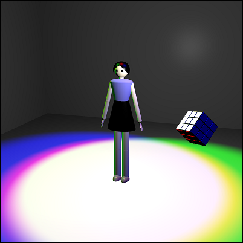

# Assignment 3: Let There Be Light

20200245 Seongji Park

## Colored Illuminance

In `blinn_phong.js`, I modified `Light` class so that illuminance value has vec3 type, instead of one number. And also I modified `BlinnPhongShader.setUniform` function so that it passes vec3 value. I used `uniform3f` instead of `uniform1f`.

In `blinn_phong.frag`, I modified `Light` structure so that `illuminance` has type `vec3` instead of `float`.

## Point Light and Spotlight Sources

I implemented point light and spotlight sources in `blinn_phong.frag`.

Implementing point light and spotlight is similar to implementing directional light. Shader calculates diffuse part and specular part.

For point light, the distance term is multiplied. Intensity of the light is in inverse proportion to the distance between fragment and point light source.

For spotlight, the angle term is multiplied. First, calculate the angle between direction of light and vector between light source and fragment. If the angle is smaller than light angle, light is calculated. Otherwise, light is not calculated. For smoothness, I have `angleSmoothness`(has value of 0 ~ 1) in `struct Light`. The intensity is interpolated between some interval. I have `transitionAngle` = light angle \* angleSmoothness. if the angle is between (light angle - transitionAngle) and (light angle + transitionAngle), the intensity is interpolated (trigonometric function is used) in value of 0 ~ 1 so the boundary of light looks smooth.

My scene has 6 light sources.

0. Ambient light
1. Spotlight (red color)
2. Spotlight (green color)
3. Spotlight (blue color)
4. Point light (white color)
5. Directional light (white color)

Point light

3 Spotlights (red, green, blue)

## Materials

My shader (`MyShader`) is implemented in `my.vert`, `my.frag`, and `my.js`.

I made `struct Material` in `my.frag`. It has five attributes.

- `ambientColor`(`vec3`): color for ambient light.
- `diffuseColor`(`vec3`): color for diffuse light.
- `specularColor`(`vec3`): color for specular light.
- `shininess`(`float`): shininess. used to calculate specular light intensity.
- `toon`(`bool`): whether to use toon shading.

I also added `Material` class in `my.js`, and modified `MyShader.setUniforms` to pass arguments for materials.

## Scene & Interaction

My scene has background, cube, and avatar. Camera angle can be changed using `SimpleOrbitControl`.

Keyboard 1, 2, 3 is mapped into three poses respectively. If press the key, avatar changes her pose. If release the key, avatar returns to idle pose.

If click avatar's body, she jumps.

Every light's illumination can be changed via slide bar.

## Toon Shading

`MyShader` has boolean value `toon` in `struct Material`, which enables toon shading. For coloring part, I applied my "stair function" (`toonDiffuse`, `toonSpecular` in `my.frag`) for calculating each diffuse light and specular light.

For outline rendering, I used normal vectors. First, calculate the angle between normal vector and camera viewing vector. Then apply sine function so that it has value of 0 ~ 1. Then apply power function, multiply by some constant, apply clamp function, and subtract the value from 1. Now, when the angle is close to 90 degree, the value is close to 0. Otherwise, the value is 1. Lastly, multiply the value into the intensity. When the angle is close to 90 degree(so the value is close to 0), the black outline is rendered.

## Arcball(modified)

Originally my arcball was acting like trackball, and I modified it so now it works properly. If check **Rotate Cube** in window, the cube can be rotated with arcball function.

Every time mouse is dragged, object(cube or avatar) is rotated with arcball.

1. Get mouse's position when mouse button is pressed, and current position. Position has value of (0, 0) ~ (800, 800). (unit is pixel)
2. My arcball is on the center of screen (400, 400), and its radius is 300 pixel. x and y value of mouse position is subtracted by 400 and divided by 300. Now (x, y) has value of (-4/3, -4/3) ~ (4/3, 4/3). Now I can consider radius of arcball as 1.
3. Calculate 3D position on arcball from (x, y) value.
   - If distance between (0, 0) and (x, y) is less than 1, calculate z position with $z=\sqrt{1-x^2-y^2}$.
   - If not, it means that (x, y) is outside of arcball(cannot calculate z position directly). I decided to map these points into back side of arcball(z has negative value). Let $r$ be the distance between (0, 0) and (x, y). Then divide x and y by $r^2$ to move (x, y) inside of arcball. Lastly, calculate z position with $z=-\sqrt{1-x^2-y^2}$. This process succesfully maps point outside the arcball into back side of the arcball.
4. Get $\mathbf v$ = (x, y, z) as current arcball vector. Get $\mathbf v_0$ as previous arcball vector in a similar way.
5. Calculate axis of rotation $\mathbf n=\mathbf v_0 \times \mathbf v$, then normalize $\mathbf n$.
6. Calculate angle of rotation using `vec3.angle`.
7. generate quaternion using `quat.setAxisAngle`. It translates axis and angle into quaternion.
8. multiply resulting quaternion into previous `localRotation` when mouse button is pressed.

Arcball functionality is implemented in `onMouseMove()` and `xy2ArcballVec()` function.
