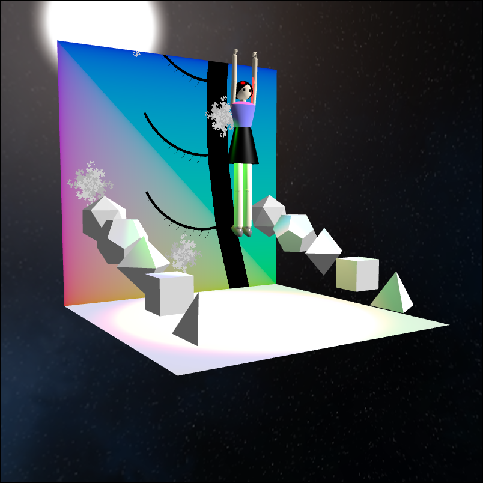

# Assignment 4: Virtual Photo Booth

20200245 Seongji Park

## Reuse HW1 - Animated Background

Animated background with fractal tree and fractal snowflakes are implemented in `MyColorPlane`, `MyTree`, `MyDragon` classes, and actual background is implemented in `MyBackground` class. First, three components are rendered into frame buffer for background. Seperate camera (`textureCamera`) is used. Then, `MyBackground` is rendered into screen, while using the frame buffer as a texture.


## Reuse HW2 - Avatar With Adjustable Pose

My avatar is implemented in `MyAvatar` class. There are interactive poses, and these are how to interact with avatar. Pose transitions are implemented with keyframe-based animation. Informations for pose(position, rotation of each parts) are in `assignment2_pose.js`.

- Initially the avatar's pose is `idle`.
- If press `1`, `2`, or `3` key, avatar changes pose to `pose1`, `pose2`, `pose3` respectively. if release `1`, `2`, or `3` key, avatar's pose returns to `idle`.
- If click avatar's body(index `1`), avatar jumps.

### Polyhedrons

My scene has some polyhedrons, which is implemented in `MyPolyhedrons` class. And there are some new functions in `primitives.js`: `generateTetrahedron`, `generateOctahedron`, `generateDodecahedron`, `generateIcosahderon`.


## Reuse HW3 - Blinn-Phong Lightings

My shader (`MyShader`) is implemented in `my.vert`, `my.frag`, and `my.js`. There are 4 types of light: `DIRECTIONAL`, `POINT`, `SPOTLIGHT`, `AMBIENT`.

`struct Material` is made in `my.frag`. It has following attributes.

- `ambientColor`(`vec3`): color for ambient light.
- `diffuseColor`(`vec3`): color for diffuse light.
- `specularColor`(`vec3`): color for specular light.
- `shininess`(`float`): shininess. used to calculate specular light intensity.
- `toon`(`bool`): whether to use toon shading.
- `perlin`(`bool`): whether to use perlin noise.

`Material` class is also added in `my.js`, and `MyShader.setUniforms` is modified to pass arguments for materials.

My scene has 6 light sources. Light soruces are created with `createMyLights()` function.

0. Ambient light
1. Spotlight (red color)
2. Spotlight (green color)
3. Spotlight (blue color)
4. Point light (white color)
5. Directional light (white color)

## Skybox

Skybox is implemented in `MyCubeMap` class. Works from lab 8(`skybox.vert`, `uv_simple.vert`, `uv_simple.frag`) are reused.


## Camera Effects

There are several camera effects. In order to apply camera effects, modified version of `Pip` from lab 9 class is used. `Pip` class has three frame buffers: `framebuffer`, `bigBuffer`, and `depthBuffer`. And also there is `MyDepthShader`, which is described in `my_depth.js`, `my.vert`, and `my_depth.frag`.

If some camera effect is enabled, the scene is not rendered directly into the screen. First, the scene is rendered into `bigBuffer` if the effect is **Fish-eye**, or `framebuffer` otherwise. Then the scene is rendered into `depthBuffer` using `MyDepthShader`. Lastly, `Pip` is rendered into the screen using `framebuffer`, `bigBuffer`, and `depthBuffer`. (`bigBuffer`, `depthBuffer` will explained later in more detail)

When rendering `Pip`, new shader called `MyPipShader` is used. `MyPipShader` is described in `my_pip_shader.js`, `unlit_texture.vert`, and `my_effect.frag`. `my_effect.frag` takes uniform variables. `mainTexture`, `depthTexture`, `bigTexture` are uniform variables from `framebuffer`, `depthBuffer`, `bigBuffer` respectively. And there are `width`, `height`, and `cameraEffect` variables to process fragments.

### 1. Color Inversion

The original color from `mainTexture` is simply reversed: `output_color.rgb = vec3(1) - texture(mainTexture, uv).rgb`


### 2. Grayscale

Every R, G, B components of output color is float value `gray`, and `gray` can be calculated with `gray = dot(texture(mainTexture, uv).rgb, vec3(0.299, 0.587, 0.114))` (this is from skeleton code of non-photorealistic rendering)


### 3. Gaussian Blurring

Gaussian blurring is implemented with parameter `sigma`, which is stDev of gaussian function. To implement blurring, `gaussian(x, y, sigma)` and `blur(sigma)` functions inside `my_effect.frag` are used. `guassian` function calculates 2D gaussian distribution function value. `blur` function calcualtes the color of one pixel as weighted average of surrounding pixels, and weight is value of `gaussian` function. The surrounding pixel is calculated only if `gaussian` is greater than 0.005 times `gaussian` of center. Otherwise, the pixel is ignored for sake of computing resources.


### 4. Fish-eye

In order to apply fish-eye effect, `bigBuffer` is used to ensure high resolution. `bigBuffer` has 8 times bigger width and height than `frameBuffer`. First, the scene is rendered with large field of view of 160 degree. Then the coordinates of image is transformed. the code for applying fish-eye is following.

```
vec2 center = vec2(width / 2.0, height / 2.0);
vec2 from_center = uv * width - center; // (-width/2 ~ width/2)
float center_dist = length(from_center / 1.5); // (0 ~ width/2)
float optical_angle = center_dist / (width / 2.0) * 1.5707963; // (0 ~ PI/2)
float cam_angle = 80.0 * 3.1415926 / 180.0;
if(optical_angle < cam_angle) {
  vec2 target = 0.5 / tan(cam_angle) * tan(optical_angle) * normalize(from_center);
  output_color.rgb = texture(bigTexture, target + vec2(0.5)).rgb;
}
else output_color.rgb = vec3(0);
```


### 5. Chromatic Aberration

To apply chromatic abberation, each R, G, B component of image is scaled with different factor. the factor is defined as `chromatic` variable.


### 6. Depth of Field

In order to apply DOF, fragment shader should know the depth. So I made `depthBuffer` and `MyDepthShader`(described in `my_depth.js`, `my.vert`, `my_depth.frag`) to save depth information. In `my_depth.frag`, the information of depth(`frag_pos.z`) is converted into RGB color values. My conversion can represent depth values of 15 to 45.

- depth < 15: the color is white.
- 15 < depth < 25 R value is (depth - 15) / 10, and G, B value is 0.
- 25 < depth < 35 R value is 1, G value is (depth - 25) / 10, and B value is 0.
- 35 < depth < 45 R, G value is 1, and B value is (depth - 35) / 10.
- depth > 45: the color is black.

Now `my_effect` can know the depth of pixel using `depthTexture`. It uses two parameters `focalLength` and `dof`. If `abs(focalLength - depth) <= dof / 2`, the pixel is not blurred. otherwise, the pixel is blurred with coefficient of `min((abs(focalLength - depth) - dof / 2), 10)`. To avoid "leaking" of focused object, there are some correction. When calculating blurring, some object in front of pixel is not calculated.

(depth buffer)


(DOF effect)


## Arcball

If **Rotate Polyhedrons** is checked, the polyhedrons are rotated with arcball. Arcball funtionality is implemented in `xy2ArcballVec`, `onMouseDown`, `onMouseUp`, `onMouseMove` functions.

When the mouse is clicked, the position of mouse is mapped into position on virtual hemisphere and saved in `prevArcballVector`(`vec3` type) variable, and rotation value of polyhedrons is saved in `prevArcballQ`(`quat` type) variable.

When mouse is moving while clicked, map position of mouse into position on virtual hemisphere and save as `v2`(`vec3` type), and let `v1 = prevArcballVector`(`vec3` type). And let `q1 = (0, -v1)` and `q2 = (0, v2)`. (q1, q2 are `quat` type) Then set current rotation of polyhedrons as `q2 * q1 * prevArcballQ`.


## Perlin Noise

Bottom plane of my scene has perlin noise. It can be enabled by clicking `Perlin Noise`. `MyShader` has uniform boolean value `perlin`, which enables perlin noise.

This is procedure to compute color of each pixel to generate perlin noise.

1. Get 3D position of fragment, and define **cell**, which is cube with size of 1, and each point has integer coordinate.
2. For each point of cell, calculate gradient value with `gradient(vec3 seed)` function. gradient value can be calculated with partial derivative of `random(vec3 seed)` function, which calculates pseudo random number with seed value.
3. For each point of cell, calcualte dot product of gradient and vector from pixel to point.
4. Interpolate dot product values of each cell with x, y, z in order.

The procedure generates float value between -1 and 1. For more visual fun, the float value is converted into different colors. First, `floor((cell + 1) * 6) % 6` is calcualted, and this value can be integer from 0 to 5. and different colors are assigned for each integer values.


## Toon Shading

`MyShader` has uniform boolean value `toon` in `struct Material`, which enables toon shading. For coloring part, I applied my "stair function" (`toonDiffuse`, `toonSpecular` in `my.frag`) for calculating each diffuse light and specular light.

For outline rendering, I used normal vectors. First, calculate the angle between normal vector and camera viewing vector. Then apply sine function so that it has value of 0 ~ 1. Then apply power function, multiply by some constant, apply clamp function, and subtract the value from 1. Now, when the angle is close to 90 degree, the value is close to 0. Otherwise, the value is 1. Lastly, multiply the value into the intensity. When the angle is close to 90 degree(so the value is close to 0), the black outline is rendered.


## User Interacion

Interatcion in HTML part:

- Blur: coefficient of gaussian blurring
- Chromatic Aberration: coefficient of chromatic aberration
- Focal length: focal length of DOF
- Depth of Field: DOF value
- Perlin Noise: enable perlin noise of bottom plane
- Toon shading: enable toon shading of avatar
- Rotate Polyhedrons: enable arcball to rotate polyhedrons
- Ambient Light
- Point Light: white light
- Directional Light: white light
- Red Light: spotlight
- Green Light: spotlight
- Blue Light: spotlight


Keyboard & Mouse to make pose

- `1`: pose 1
- `2`: pose 2
- `3`: pose 3
- clicking avatar's body: jump

(pose 1)


(pose 2)


(pose 3)


(jump - ready)


(jump)


